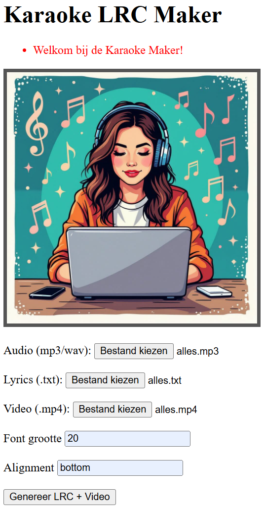

# Karaoke maker

This project consists of 3 parts

### lrc file maker
1.  Input  : music audio (e.g. MP3/WAV), lyrics (TXT ) 
    Output : file with timed lyrics (LRC)
    - Synchronize a song file with the music (MP3). Capture sung audio (NL) and reference lyrics (text file).
    - Transcribe audio with Whisper -> segments with timestamps.
    - Align the lyrics lines with the Whisper segments via DTW over a cost matrix.
    - Write .lrc with proper timings (1 line -> 1 timestamp), monotonous, and smoothed.

    - The script focuses on actual audio analysis instead of just Whisper segments:
        1. Uses forced alignment at the word level
        2. Detects silences and pauses in audio
        3. Combines multiple audio cues for better timing
        4. Uses phonetic matching for <b>Dutch</b> texts
        5. For other languages we need to alter some lines (not much!)

### karaoke video maker
2.  Input  : background video (e.g. MP4), music audio (e.g. MP3/WAV), LRC lyrics made in part 1 of the project (LRC file) 
    Output : a new video with the audio replaced by the music file and burned-in subtitles synced from the LRC.

    - The script converts LRC -> SRT, then uses ffmpeg's subtitles filter (libass) to burn in.
    - It supports multiple timestamps per line (the same lyric repeated at different times).
    - It tolerates both mm:ss.xx and mm:ss formats, and [offset:1234] tags (ms) in the LRC.
    - For best results, keep your video and audio lengths roughly similar; ffmpeg will stop at the shortest by default.

### FLASK GUI
3.  User interface to make this project easier to use  

 

 

### Install

- create a virtual environment:         py -3 -m venv venv
- activate the virtual environment:     venv\Scripts\activate
- ffmpeg installed and on PATH (https://ffmpeg.org/)
- install the modules:                  pip install requirements.txt
 

### Run
- start the Flask script:               python -m flask run --host=0.0.0.0
- goto the index page in your browser:  http://127.0.0.1:5000
- fill in the required file names and variables
    - you can test with the files in this project:
        - Audio = sample.mp3
        - Lyrics = sample.txt
        - Video = sample.mp4
        - Font size = 20
        - Alignment = bottom
- hit <GENEREER LRC + VIDEO>

# Need help?
### Go to my website and send me a message 
<a href="https://www.stillhaveit.nl/#contact" target="_blank">Still Have IT</a>
 
<b>JossieB</b>